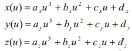

# Taller de splines

## Propósito

Estudiar algunos tipos de curvas paramétricas y sus propiedades.

## Tarea

Implemente las curvas cúbicas naturales, de Hermite y Bezier (cúbica y de grado 7), de acuerdo a las indicaciones del sketch adjunto.

*Sugerencia:* Como las curvas de Hermite y cúbica de Bezier requieren varias secciones, reacomode los puntos de control para que su continuidad sea C1. Ver [acá](https://visualcomputing.github.io/Curves/#/5/5) y [propiedad 4 de acá](https://visualcomputing.github.io/Curves/#/6/4).

## Profundización

Represente los _boids_ del [FlockOfBoids](https://github.com/VisualComputing/framesjs/tree/processing/examples/Advanced/FlockOfBoids) mediante superficies de spline.

## Integrantes

Máximo 3.

Complete la tabla:

| Integrante | github nick |
|------------|-------------|
| Sebastian David Moreno | sdmorenob |
| Cristian Camilo Orjuela | CristianOrjuela |

## Entrega

* Modo de entrega: Haga [fork](https://help.github.com/articles/fork-a-repo/) de la plantilla e informe la url del repo en la hoja *urls* de la plantilla compartida (una sola vez por grupo). Plazo: 6/5/18 a las 24h.

## Discusión

### Curvas  Cúbicas Naturales:
La representación de las curvas naturales se determinan a través de la implementación de polinomios de tercer orden o polinomios de grado tres y que tienen como punto de corte un punto de control establecido dentro de la escena. Adicionalmente, las curvas cúbicas naturales terminan siendo una representación matemática de un dibujo técnico de una spline original, es decir, que se requieren dos secciones de curvas adyacentes que tengan tanto la primera como 
la segunda derivada en su frontera común, garantizando y exigigiendo de por sí continuidad C2.
	

	
En ese sentido cabe resaltar que a partir del sistema de ecuaciones anterior, se realiza el cálculo de los coeficientes y los parámetros particulares a partir de la construcción de matrices con el fin de encontrar la curva cúbica natural.
En la siguiente imagen se representa una curva cúbica con un número específico de puntos de control.
	

	
	
### Curvas de Hermite

Las curvas de Hermite tienen la característica particular de poseer una tangente específica en cada uno de los puntos de control, con lo cual se determina un control local en cualquier par de puntos. En la implementación, 
estas curvas se realiza un tipo de interpolación de puntos como una función polinómica en específico. Tienen un factor fundamental que tiene variación entre 0 y 1, y se establece para poder realizar la construcción de la
curva en cada uno de los puntos de la trayectoria.
	
Gracias a que son una particularidad de las curvas cúbicas, existe un sistema de ecuaciones que permite realizar el cálculo de las mismas.

	
Aquí un ejemplo de las curvas de Hermite con 8 puntos de control.
	

### Curvas de Bezier

Las curvas de Bezier son igualmente un tipo de interpolación que se realiza a partir de unos puntos de control dados, es decir, que busca encontrar la curva con mayor suavidad que se recorre desde el primer punto de control
hasta el último, garantizando la continuidad y la variación de acuerdo a la "atracción" de los puntos intermedios de control. 

Asimismo, para una mejor implementación de la curva se realiza la implementación del algoritmo de _Casteljau_ con el fin de actualizar los puntos de control en cada iteración. En seguida, la interpretación matemática del algoritmo.

Un ejemplo particular del cálculo de los puntos intermedios viene dado a continuación. 

	
En la siguiente imagen se observa un ejemplo de una curva de Bezier cúbica.
	

En la imagen posterior, se muestra una curva de Bezier con 8 puntos de control.

### Continuidad:

-*Continuidad de orden cero* _C0_: Esta continuidad se cumple gracias a la unión de las curvas que se unen durante la trayectoria de un punto de control inicial a un punto de control final.

-*Continuidad de primer orden*: Este tipo de continuidad se garantiza en las curvas al saber que las primeras derivadas, tangentes a la curva, en los puntos intermedios de cualquier par de puntos en la curva son iguales en su punto de unión.

-*Continuidad de segundo orden*: Además de cumplir la continuidad de primer orden, se debe cumplir que la variación de los vectores tangentes de a cuerdo a la perspectiva de acercamiento (izquierda o derecha) son iguales. 

	
## Referencias

- [Curvas Naturales - Curvas de Hermite - Continuidad](http://www.inf-cr.uclm.es/www/cglez/downloads/docencia/AC/splines.pdf) 

- [Representaciones y conceptos de curvas](https://esaulgd.files.wordpress.com/2012/10/09_curvasysuperficies.pdf)

- [Curvas de Hermite](http://fivedots.coe.psu.ac.th/Software.coe/Java%20Games/Java3D/Muscle3D/Hermite/Hermite%20Curve%20Interpolation.htm)

- [Curvas en general - Representación curvas](https://www.fing.edu.uy/inco/cursos/compgraf/Clases/2012/09-Curvas%20y%20Superficies.pdf)

- [Curvas de Bezier - Pseudocódigo](https://es.wikipedia.org/wiki/Curva_de_B%C3%A9zier#Curvas_c%C3%BAbicas_de_B%C3%A9zier)
 
- [Curvas de De Casteljau](http://ocw.upm.es/matematica-aplicada/curvas-y-superficies-en-el-diseno-geometrico-asistido-por-ordenador/contenido/curvas_polinomicas/algoritmo-de-de-casteljau)
 
- [Curvas de Bezier - Java Implementation ](http://javasolving.blogspot.com.co/2013/02/como-dibujar-una-curva-de-bezier.html)

	
	